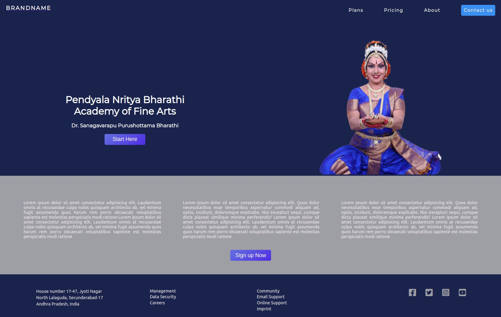

## About

This is a full-stack project, the frontend part of which was created using [Reactjs](https://reactjs.org/).
The following npm packages were used for the development of this website :-
- react-router-dom
- Express.js
- Stripe.js
- Mongoose 

## How Do I test it?

You can do so by navigating to the root directory of the project and typing the following command in the terminal.

    npm start

It runs the app in the development mode. 
You can view the website in the web browser of your choice by visitng the url [http://localhost:3000](http://localhost:3000).

The page will reload if you make edits. 
You will also see any lint errors in the console.

You can use the following command to launches the test runner in the interactive watch mode.

    npm test

See the section about [running tests](https://facebook.github.io/create-react-app/docs/running-tests) for more information.

Or perhaps you would like to checkout the production ready build version of the web app, then type the following command in the terminal
    
    npm run build

which builds the app for production to a `build` folder. 
It correctly bundles React in production mode and optimizes the build for the best performance.

The build is minified and the filenames include the hashes. 
Your app is ready to be deployed!

## Credits
The website is created entirely by myself however the illustrations used in the website have been taken from freepik.com, a free svg sharing website which allows developers to use svg even for commercial purposes by acknowledging the designers.

The credit for illustrations used on this website goes to freepik.com as those illustrations are uploaded by freepik developement team. I humbly thank freepik for their great website which provides developers such an option. Kudos.